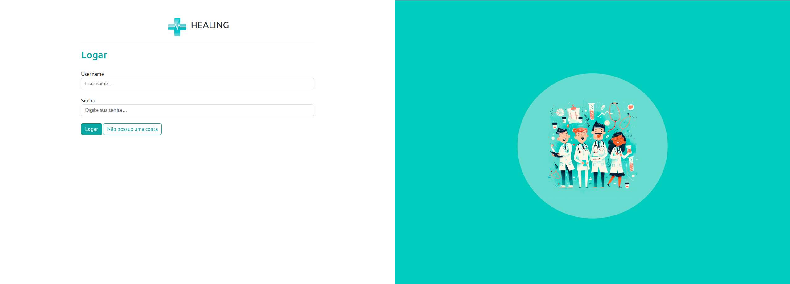
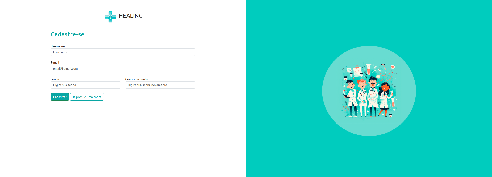
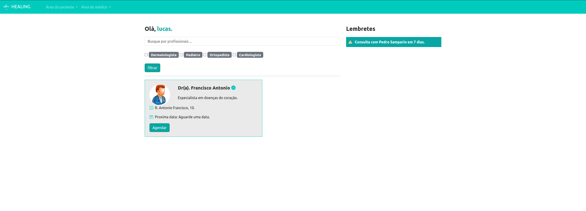
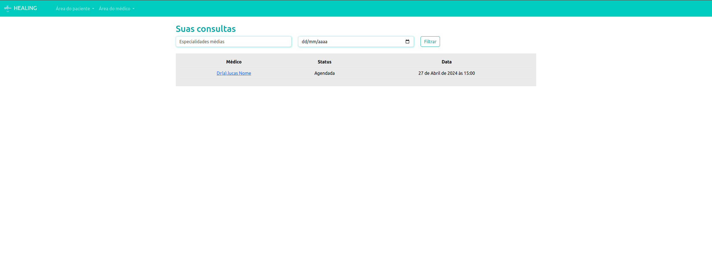
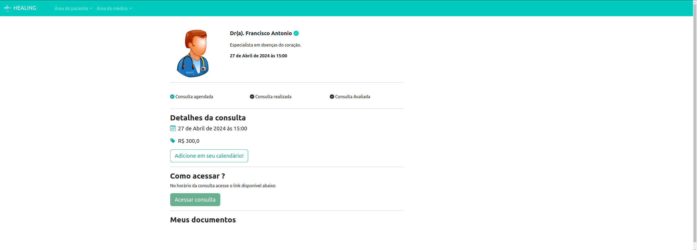
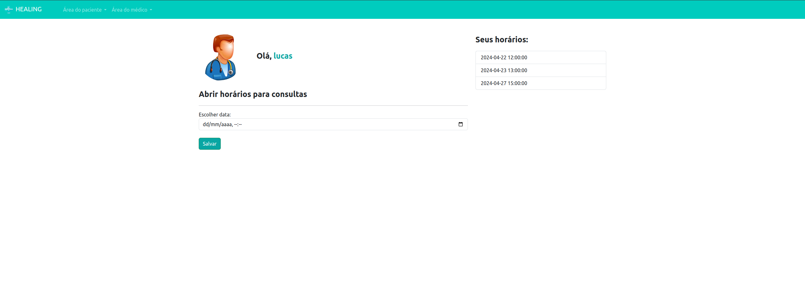
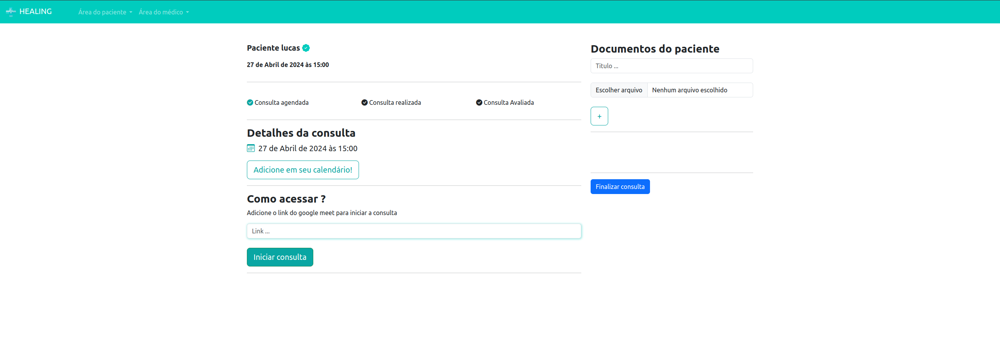

<h1 align="center" style="font-weight: bold;">PYSTACK WEEK 10.0 PROJETO HEALING 💻</h1>


Nesse repositório contém um projeto realizado durante o evendo PYSTACK WEEK 10.0, o evento abordou os principais conceitos de Python e Django. Ótimo conteúdo abordado, porém agreguei ao projeto conceitos que não foram abordados no evento, como por exemplo: a utilização do Docker. Com isso, a aplicação que já era legal se tornou melhor e escalável. O Projeto consiste em uma aplicação django para agendamentos de consultas médicas contendo módulos de pacientes e médicos. O paciente consegue agendar suas consultas, realizar pesquisas por especialidades médicas e download de documentos receitas/atestados. O médico consegue iniciar a consulta, upload de documentos, finalizar a consulta e as mesmas operações do paciente.


<h2>Pré-requisitos</h2>

- [Python](https://www.python.org/) 
- [Django](https://www.djangoproject.com/)
- [Docker](https://www.docker.com/) 


<h2>Clone</h2>

Como clonar o projeto:


```bash
git clone git@github.com:lucas-ioliveira/pystack_week_10.git
```


<h2 id="started">🚀 Primeiros passos</h2>

<p>Back-End</p>

- Isso fará com que todas as dependências sejam instaladas e um container docker seja executado.
- Basta entrar no diretório pystack_week_10 acessar o terminal e rodar o comando: 

```bash
docker compose -f docker-compose.yml up -d --build
```


<h2 id="routes">📍 Rotas do projeto</h2>


**Autenticação**
   
| <kbd>usuarios/login</kbd> | Autenticação do usuário.



<br>
   
| <kbd>usuarios/cadastro</kbd> | Cadastro do usuário.



<br>

**PACIENTES**
   
| <kbd>pacientes/home</kbd> | Home.



<br>

| <kbd>pacientes/minhas_consultas</kbd> | Consultas agendadas.



<br>

| <kbd>pacientes/consultas/id</kbd> | Iniciar a consulta.



<br>

**MÉDICO**
   
| <kbd>medicos/abrir_horarios</kbd> | Abrir horários de atendimentos.



<br>

| <kbd>medicos/consultas_medico</kbd> | Consultas agendadas para atendimentos.


<br>

| <kbd>medicos/consulta_area_medico/id</kbd> | Iniciar consulta.



<br>